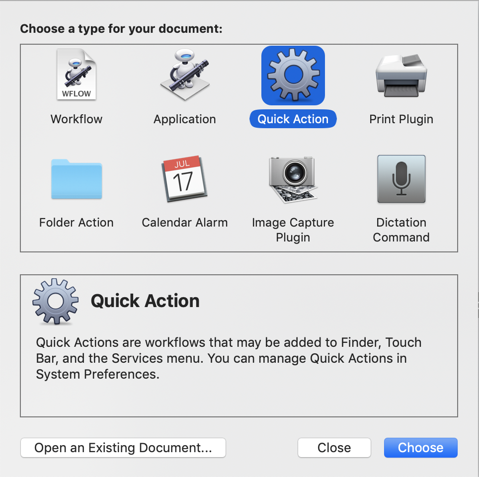
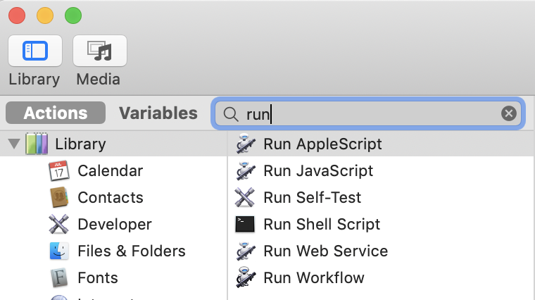
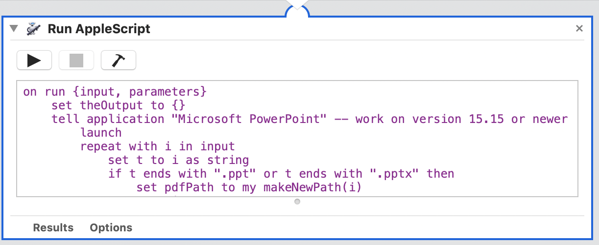
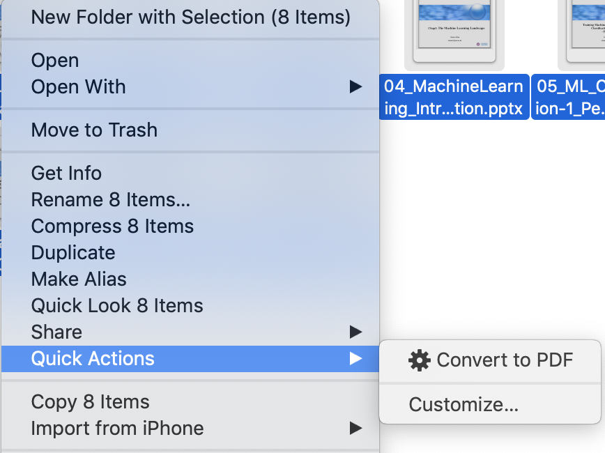

# Convert to PDF

Batch convert every ppt to pdf files by Automator on MacOS

## How to make the Convert to PDF

1. Launch the Automator
2. Choose a type as *Quick Action* for your documents
3. Find Actions, 'Run AppleScript'
4. Type the AppleScript
   - Set the input setting
   - Type the script
5. Save the *Quick Action*

---

### Launch the Automator


### Choose a type for your documents

Choose *Quick Action* type



### Find Actions

Find Actions 'Run AppleScript'



### Type the AppleScript

#### Set the input setting

- documents in Finder


#### Type the script like below



##### AppleScript

```app
on run {input, parameters}
	set theOutput to {}
	tell application "Microsoft PowerPoint" -- work on version 15.15 or newer
		launch
		repeat with i in input
			set t to i as string
			if t ends with ".ppt" or t ends with ".pptx" then
				set pdfPath to my makeNewPath(i)
				open i
				save active presentation in pdfPath as save as PDF -- save in same folder
				set end of theOutput to pdfPath as alias
			end if
		end repeat
	end tell
	tell application "Microsoft PowerPoint" -- work on version 15.15 or newer
		quit
	end tell
	return theOutput
end run

on makeNewPath(f)
	set t to f as string
	if t ends with ".pptx" then
		return (text 1 thru -5 of t) & "pdf"
	else
		return (text 1 thru -4 of t) & "pdf"
	end if
end makeNewPath
```

---

## Run the Convert to PDF

